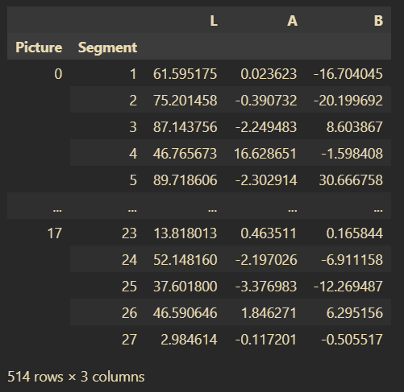
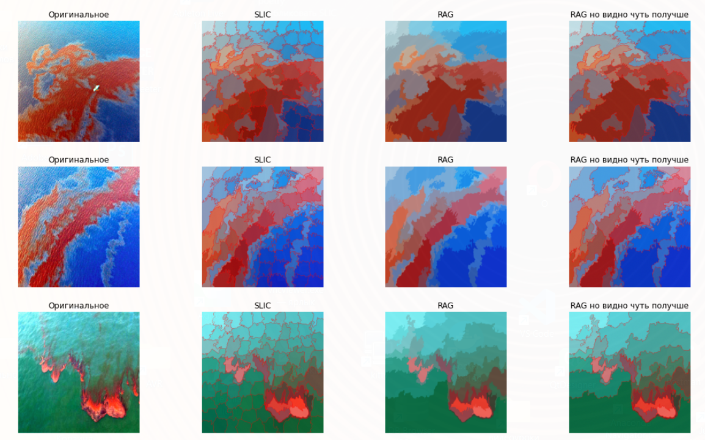
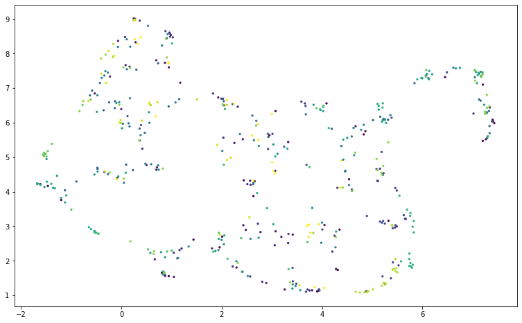
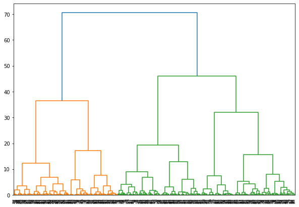
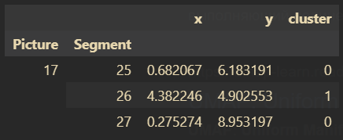
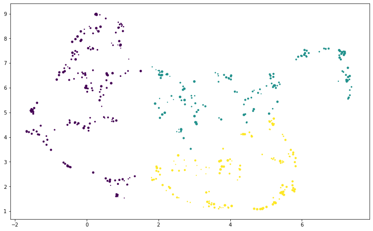
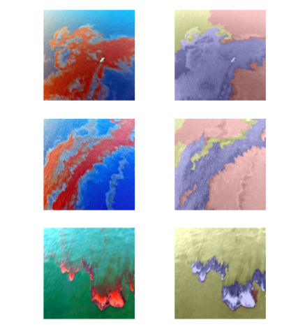

# Обнаружение разливов отходов в океане
Во время прохождения учебной практики в компании "Съёмка с воздуха", была дана задача - разрабтотать и проверить методику обнаружения разливов отходов в море/океане, без нейросетевых алгоритмов  
Суть метода заключается в выявлении значительно отличающихся от остального изображения фрагментов, и их кластеризация по степени отличия  
Для работы был собран своими силами датасет из порядка 20 изображений  

## Основной алгоритм
1. Предобработка - prepare_data.ipynb
   1. Базовая предобработка - приведение к одному разрешению, повышение контрастности
   2. Применение SLIC - разбиение на суперпиксели
   3. Построение RAG - граф "схожести" соседних суперпикселей
   4. Объединение схожих суперпикселей в "регион" и окраска "регионов" в их средний тон
   5. Запись полученной информации в regions.csv (id изображения, id региона, LAB региона)
     
### *Пример результата*
 

2. Кластеризация - umap.ipynb
   1. Применение UMAP, нелинейное снижение размерности, на regions.csv  
   
   2. Применение иерархической кластеризации и разбиение на три кластера
     
   *x, y - положение региона в UMAP, cluster - кластер к которому принадлежит регион*  
     
   *Принадлежность регионов к кластерам*
   
   3. Визуализация результатов кластеризации  
   
